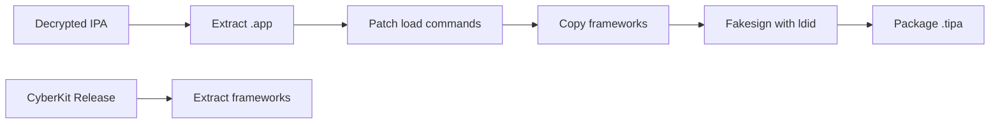

# CyberKit Injection Automation

This directory contains tools to automate CyberKit framework injection into iOS browser IPAs.

## Files

| File | Purpose |
|------|---------|
| `.github/workflows/inject-cyberkit.yml` | GitHub Actions workflow for cloud-based injection |
| `inject-cyberkit.sh` | Standalone script for local macOS/Linux injection |
| `inject.sh` | Legacy script (from previous work) |

---

## Option 1: GitHub Actions (Recommended)

Run the injection entirely in the cloud using GitHub's macOS runners.

### Setup

1. **Fork the repo** (or push these files to your own repo)
2. Go to **Actions** → **Inject CyberKit into IPA**
3. Click **Run workflow**
4. Fill in:
   - `ipa_url`: Direct download URL for your decrypted Brave IPA
   - `cyberkit_tag`: The CyberKit release to use (default: `v0.0.9-alpha`)
   - `output_name`: Desired output filename

### Example

```
ipa_url: https://your-host.com/Brave-decrypted.ipa
cyberkit_tag: v0.0.9-alpha
output_name: Brave-CyberKit
```

The workflow will:
1. Download CyberKit release from [CyberKitGroup/CyberKit](https://github.com/CyberKitGroup/CyberKit/releases)
2. Download your target IPA
3. Patch load commands (WebKit → CyberKit)
4. Copy frameworks
5. Fakesign with `ldid`
6. Output `Brave-CyberKit.tipa` as a downloadable artifact

---

## Option 2: Local Script (macOS/Linux)

Run injection locally on your machine.

### Requirements

```bash
# macOS
brew install ldid

# Linux (Ubuntu/Debian)
sudo apt install llvm ldid
```

### Usage

```bash
# First, extract CyberKit frameworks from a release
unzip CyberKit-MobileMiniBrowser.tipa -d cyberkit_extract
FRAMEWORKS=cyberkit_extract/Payload/MobileMiniBrowser.app/Frameworks

# Run injection
./inject-cyberkit.sh Brave-decrypted.ipa "$FRAMEWORKS" Brave-CyberKit

# Output: Brave-CyberKit.tipa
```

---

## How It Works

The injection process follows the [CyberKit wiki](https://github.com/CyberKitGroup/CyberKit/wiki/CyberKit-Injection):



### Key Transformations

| Original Dependency | Redirected To |
|---------------------|---------------|
| `/System/Library/Frameworks/WebKit.framework/WebKit` | `@rpath/CyberKit.framework/CyberKit` |
| `/System/Library/Frameworks/JavaScriptCore.framework/JavaScriptCore` | `@rpath/CyberCore.framework/CyberCore` |
| `/System/Library/Frameworks/WebKitLegacy.framework/WebKitLegacy` | `@rpath/CyberKitLegacy.framework/CyberKitLegacy` |

---

## Troubleshooting

### TrollStore ldid Error 175/168

If you get ldid errors during TrollStore installation:
- Make sure all `_CodeSignature` directories are removed before packaging
- The script handles this automatically

### App crashes on launch

1. Check iOS version compatibility with CyberKit release
2. Verify all frameworks were copied correctly
3. Check that load commands were properly patched with `otool -L`

### Workflow fails to download IPA

Make sure the IPA URL is a **direct download link** (not a page with a download button).
